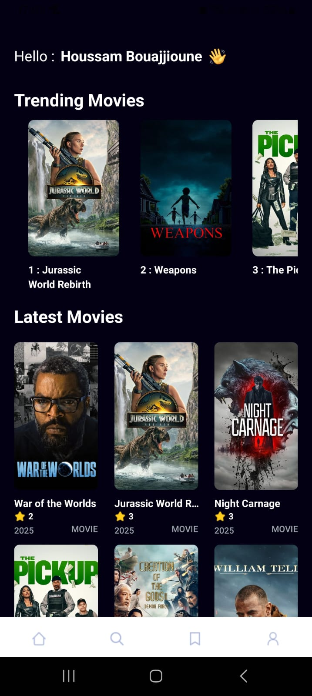
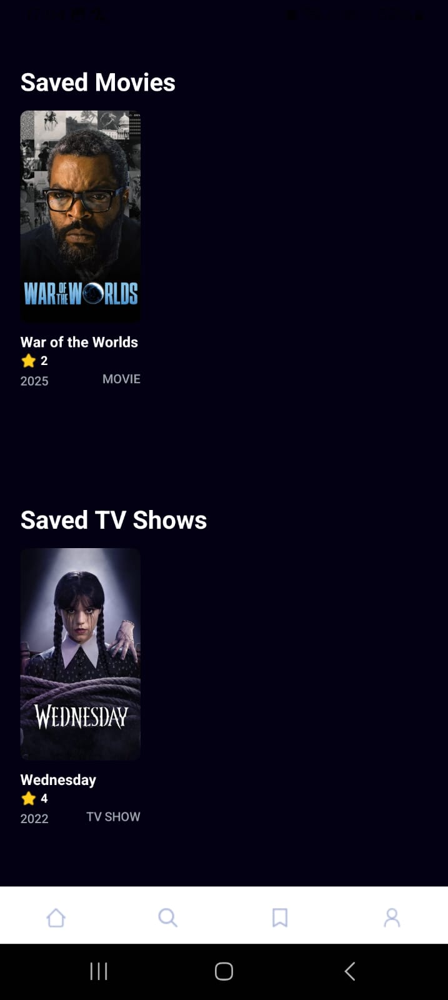

# 🎬 Movie Recommendation App

A modern mobile application built with **React Native (Expo)** that helps users discover and explore movies using **The Movie Database (TMDB) API**. The app recommends trending, popular, and personalized movies, allowing users to browse details, search by genre, and save favorites.

---

## 🚀 Features

✅ **Browse Movies** – Discover trending, top-rated, and upcoming films.  
✅ **Movie Details** – View synopsis, cast, release date, runtime, genres, ratings, and trailers.  
✅ **Search & Filter** – Search movies by title or filter by genre.  
✅ **Save Favorites** – Bookmark movies for quick access later.  
✅ **Responsive UI** – Optimized for iOS & Android devices.

---

## 🛠 Tech Stack

| Technology      | Purpose |
|-----------------|---------|
| **React Native (Expo)** | Cross-platform mobile development |
| **TypeScript**  | Type safety & maintainability |
| **TMDB API**    | Movie data & recommendations |
| **Zustand / Context API** | Global state management |
| **AsyncStorage** | Local storage for favorites |
| **React Navigation** | Navigation between screens |
| **TailwindCSS / NativeWind** | Styling |

---

## 📂 Project Structure

```
movie-recommendation-app/
│── assets/           # Images, icons, fonts, and other static media
│── components/       # Reusable UI components
│── constants/        # API config, colors, static data, etc.
│── services/         # API calls and data-fetching logic
│── app/              # App screens (Home, Details, Search, Favorites)
│── interfaces/       # TypeScript interfaces for data shapes
│── types/            # Global TypeScript types and enums
│── app.json          # Expo configuration
│── package.json      # Project dependencies & scripts
```

---

## 🔑 Getting Started

### 1️⃣ Prerequisites
- **Node.js** (v18+ recommended)  
- **Expo CLI** installed globally:  
  ```bash
  npm install -g expo-cli
  ```
- **TMDB API Key** ([Get it here](https://www.themoviedb.org/documentation/api))

---

### 2️⃣ Installation

```bash
# Clone the repository
git clone https://github.com/HoussamBouajjioune/alx-project-nexus-Movie-Recommendation-App.git

# Navigate to project folder
cd movie-recommendation-app

# Install dependencies
npm install

# Create an .env file and add your TMDB API key
EXPO_PUBLIC_MOVIE_API_KEY=your_api_key_here
```

---

### 3️⃣ Running the App

```bash
# Start the development server
npx expo start
```

- Press **"i"** to run on iOS simulator  
- Press **"a"** to run on Android emulator  
- Or scan the QR code in the Expo Go app on your device

---

## 📡 API Integration

This app uses **The Movie Database (TMDB) API** for fetching:  
- Trending movies  
- Top-rated movies  
- Movie details  
- Search results  
- Genre lists

API documentation: [https://developer.themoviedb.org](https://developer.themoviedb.org)

---

## 📸 Screenshots

| Home Screen | Movie Details | Favorites |
|-------------|--------------|-----------|
|  |  |  |

---

## 📜 License

This project is licensed under the **MIT License** – feel free to use and modify it.

---

## 🤝 Contributing

Pull requests are welcome. For major changes, please open an issue first to discuss what you would like to change.
